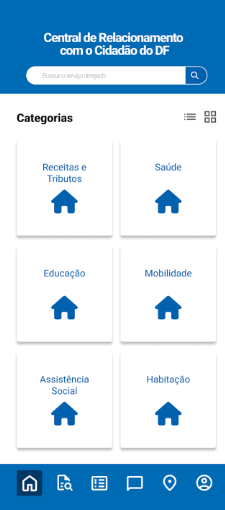
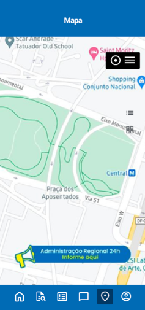
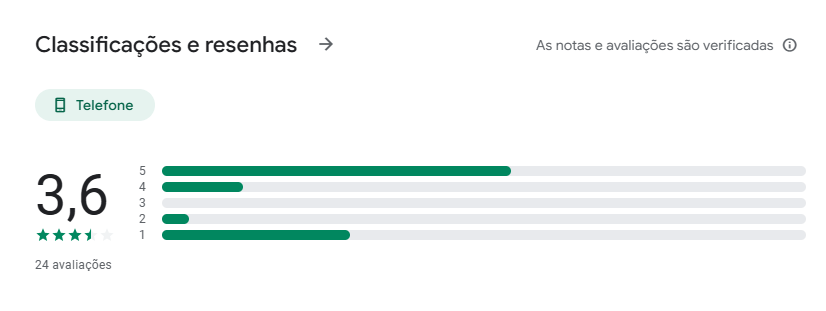
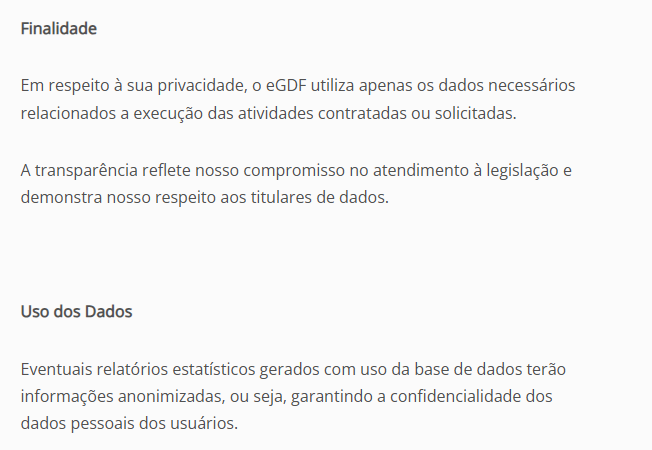
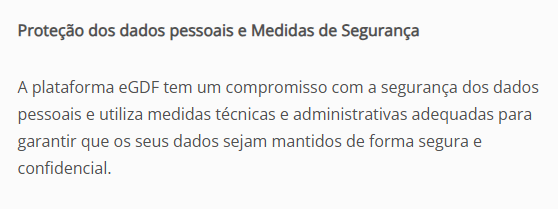
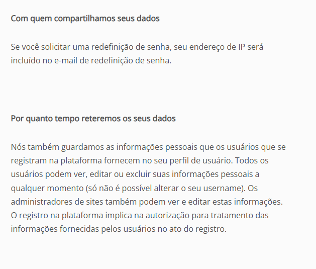
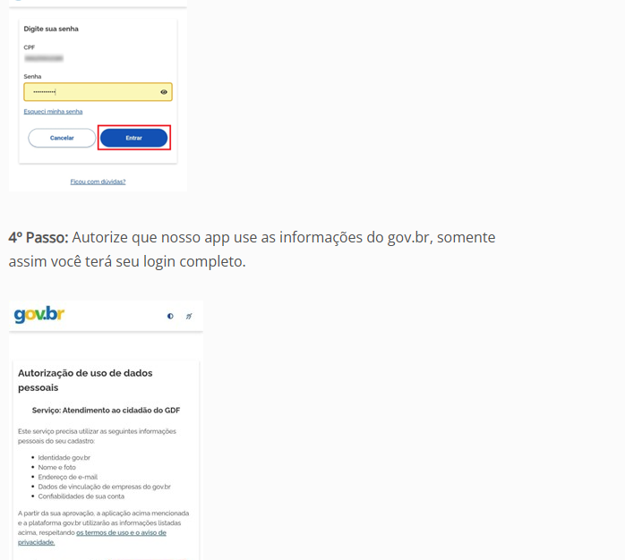
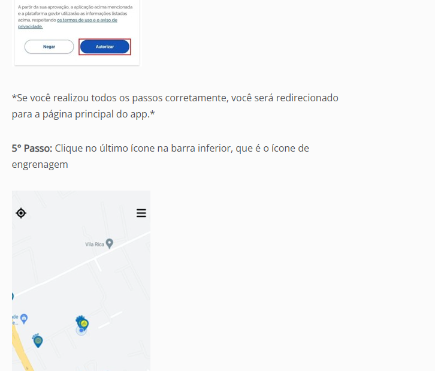

# Análise de documentos

## 1 Introdução

### 1.1 Descrição

O aplicativo a ser analizado é o eGDF, esse aplicativo suporta tanto android quanto ios. O eGDF é uma plataforma do Governo do Distrito Federal que oferece acesso centralizado a diversos serviços públicos para os cidadãos do Distrito Federal.

### 1.2 Objetivo

Esta análise tem como objetivo examinar os documentos disponíveis publicamente sobre o funcionamento do app eGDF, identificando as funcionalidades principais do app e avaliar uso e acessibilidade com base nos dados obtidos de fontes de avaliações de usuários.

## 2 Fontes documentais analisadas

### 2.1 Play Store e App Store

As versões do aplicativo **eGDF** nas lojas **Play Store** e **App Store** são as seguintes:

- **Versão na Play Store:** 3.1.3
- **Versão na App Store:** 3.1.2

Figura 1: Versão do eGDF na PlayStore

Figura 2: Versão do eGDF na AppStore com novidades da nova versão

Na versão 3.1.2 da App Store, foram deitas correções visuais, ajustando para uma interface mais intuitiva, adicionamento de notícias, sendo possível acompanhar comunicados oficiais pelo aplicativo, e a funcionalidade de inscrições em creche, permitindo que responáveis façam a inscrição de crianças em creches de maneira simples e rápida. Já a versão 3.1.3 da Play store não mostra as alterações dessa nova versão, apenas o app por inteiro. A faixa etária indicada para o uso do aplicativo é de 12 anos pra cima, o que limita mais os possíveis usuários do aplicativo.

Analisando as telas de captura do aplicativo na PlayStore, o aplicativo eGDF oferece duas opções de uso, o usuário tem a opção de fazer login com a conta gov.br ou utilizar o aplicativo sem login. Além disso, o usuário pode buscar o tipo de serviço público que ele deseja, como receitas e tributos, saúde, educação, mobilidade, habilitação, assistência social, dentre outros. O aplicativo também possui um mapa.

Figura 3: Tela de login

Figura 4: Tela de serviços

Figura 5:
 Tela do mapa

Figura 6: Tela do ChatBot

### 2.1.1 Funcionalidades identificadas

Foram identificadas as seguintes funcionalidades:

- **Login com gov.br:** Autenticação que usa o CPF e a senha do gov.br.
- **Solicitação de serviços públicos:** Serviços como poda de árvores, coleta de lixo, manutenção de vias etc.
- **Verificação de solicitações:** Os usuários podem acompanhar o progresso de cada pedido em tempo real.
- **Assistente Virtual (IA):** Interação com chatbot para suporte.
- **Confirmação de problemas:** Os cidadãos podem confirmar ocorrências já reportadas.
- **Exclusão de conta:** Possibilidade de exclusão total do perfil e dados pelo app.

Figura 7: Funcionalidades do aplicativo

## 2.1.2 Avaliações de usuários

As avaliações dos usuários estão acima da média com uma nota de 3.6 estrelas com 24 avaliações na Play Store e uma nota de 3.5 estrelas com 8 avaliações na App Store. A similiaridade da média das notas indicam uma consistência nas experiências dos usuários e revelam características críticas que impactam a experiência no uso do aplicativo. Apenas na Play Store possui comentários sobre a experiência dos usuários com o aplicativo, sendo os principais pontos:

- **Problemas de login:** Falhas na autenticação.
- **Acessibilidade precária:** Dificuldade para usuários com baixa visão devido a ícones e textos pequenos.

Figura 8: Média das avaliações na PlayStore

Figura 9: Média das avaliações na Appstore

Figura 10: Avaliações dos usuários 1

Figura 11: Avaliações dos usuários 2

Figura 12: Avaliações dos usuários 3

Figura 13: Avaliações dos usuários 4

## 2.2 Política de privacidade

Os dados pessoais do usuário são protegidos em conformidade com a Lei Geral de Proteção de Dados (LGPD), sendo coletado afim de identificação do usuário. A plataforma também coleta dados necessários para a execução dos serviços solicitados, como a solicitação de serviços públicos e acompanhamento de solicitações. Esses dados podem ser anonimados para a criação de relatórios estatísticos. Os usuários têm o direito de acessar, alterar ou excluir suas informações pessoais diretamente no perfil, e seus dados não são compartilhados com terceiros, exceto por exigência legal ou judicial. 

Figura 14: Política de privacidade

Figura 15: Finalidade e uso dos dados

Figura 16: Proteção dos dados

Figura 17: Destino dos dados

Figura 18: Compartilhamento dos dados

## 2.3 Exclusão de Conta
Através do site do eGDF foi identificado e aprofundado sobre a funcionalidade de exclusão de conta. Para isso é preciso:

1. Fazer login com a conta gov.
2. Autenticar-se com CPF e senha.
3. Autorizar uso de dados pelo eGDF.
4. Acessar a aba de configurações.
5. Selecionar “Excluir conta”.
6. Confirmar a decisão.

Essa opção permite com que o usuário controle sobre seus dados no aplicativo, respeitando a Lei Geral de Proteção de Dados explicitada na política de privacidade.

Figura 19: Exclusão de conta - 1

Figura 20: Exclusão de conta - 2

Figura 21: Exclusão de conta - 3

Figura 22: Exclusão de conta - 4

Figura 23: Exclusão de conta - 5

Figura 24: Exclusão de conta - 6

Figura 25: Exclusão de conta - 7

---

## 3 Requisitos identificados
Com base nos documentos analisados, os seguintes requisitos identificados estão representados na tabela abaixo:

| Código   | Descrição                                                                                                         |
|----------|-------------------------------------------------------------------------------------------------------------------|
| RF01     | O sistema deve permitir que o usuário realize login.                                                             |
| RF02     | O sistema deve permitir que o usuário solicite serviços públicos como coleta de lixo, reparo de vias e diversos.                |
| RF03    | O sistema deve permitir o usuário utilizar um mapa para localizar onde foi solicitado o serviço   |
| RF04     | O sistema deve permitir que o usuário visualize e acompanhe o status das suas solicitações.                     |
| RF05     | O sistema deve oferecer um assistente virtual para ajudar o usuário em dúvidas.                 |
| RF06     | O sistema deve permitir que o usuário confirme a resolução de problemas relatados.                              |
| RF07     | O sistema deve permitir que o usuário exclua seus dados e conta do aplicativo.                           |
| RF08    | O sistema deve permitindo aumentar ícones e o tamanho da fonte confrome a necessidade do usuário por meio de um botão.   |
| RNF01    | O sistema deve ser compatível com vários dispositivos como Android e IOS                                |
| RNF02    | O sistema deve estar em conformidade com a Lei Geral de Proteção de Dados (LGPD).                               |
| RNF03    | O sistema deve ter uma interface intuitiva                               |

Fonte: Elaborado pelo autor (Lucas Mendonça Arruda, 2025).

**Legenda:**
- **RF** – Requisito Funcional  
- **RNF** – Requisito Não Funcional

## Limitações da análise

o app é novo e lançou no dia 10 de maio de 2024 na playstore enquanto na appstore a primeira versão do app foi lançada em 28 de maio de 2024. Por esse motivo, há pouca documentação disponível publicamente e um número reduzido de avaliações dos usuários sobre o aplivativo. 

## Referências Bibliográficas 

GOVERNO DO DISTRITO FEDERAL. Aplicativo eGDF PlayStore. Disponível em: [https://play.google.com/store/apps/details?id=br.gov.df.eGDF&hl=pt_BR](https://play.google.com/store/apps/details?id=br.gov.df.eGDF&hl=pt_BR). Acesso em:30 abr 2025.

GOVERNO DO DISTRITO FEDERAL. Aplicativo eGDF AppStore. Disponível em: [https://apps.apple.com/br/app/egdf/id6502908159?l=en-GB](https://apps.apple.com/br/app/egdf/id6502908159?l=en-GB). Acesso em:30 abr 2025.

GOVERNO DO DISTRITO FEDERAL. Exclusão conta eGDF. Brasília: GDF, 2024. Disponível em: [https://www.df.gov.br/exclusao-conta-egdf/](https://www.df.gov.br/exclusao-conta-egdf/). Acesso em: 30 abr 2025.

GOVERNO DO DISTRITO FEDERAL. Política de privacidade do eGDF. Brasília: GDF, 2025. Disponível em: [https://www.df.gov.br/politica-privacidade-egdf/](https://www.df.gov.br/politica-privacidade-egdf/). Acesso em: 30 abr 2025.

## Bibliografia

VAZQUEZ, Carlos Eduardo; SIMÕES, Guilherme Siqueira. Engenharia de Requisitos: software orientado ao negócio. 1. ed. Rio de Janeiro: Brasport, 2016. Disponível em: [https://www.kufunda.net/publicdocs/Engenharia%20de%20Requisitos%20software%20orientado%20ao%20neg%C3%B3cio%20(Carlos%20Eduardo%20Vazquez%20etc.).pdf](https://www.kufunda.net/publicdocs/Engenharia%20de%20Requisitos%20software%20orientado%20ao%20neg%C3%B3cio%20(Carlos%20Eduardo%20Vazquez%20etc.).pdf). Acesso em: 30 abr 2025.

UNIVERSIDADE DE BRASÍLIA. FGA0313 – Requisitos de Software – Turma T03 (2025.1 – 35M12). Docente: ANDRE BARROS DE SALES. Plano de ensino disponível em: [Plano de Ensino](https://aprender3.unb.br/pluginfile.php/3095981/mod_resource/content/57/FGA0303-T03.pdf). Acesso em: 30 abr. 2025.

## Histórico de Versões

| Versão | Descrição                                                      | Autor(es)                            | Data       | Revisor(es)         | Data de revisão |
|--------|----------------------------------------------------------------|--------------------------------------|------------|---------------------|------------------|
| 1.0    | Adição da documentação da Análise de documentos                                       | [Lucas Mendonça](https://github.com/lucasarruda9) | 30/04/2025 | [Artur Mendonça](https://github.com/ArtyMend07) | 30/04/2025       |
| 1.1    | Adição das imagens, requisitos e novos documentos                                      | [Lucas Mendonça](https://github.com/lucasarruda9) | 01/05/2025 | [Artur Mendonça](https://github.com/ArtyMend07) | 01/05/2025       |

---
