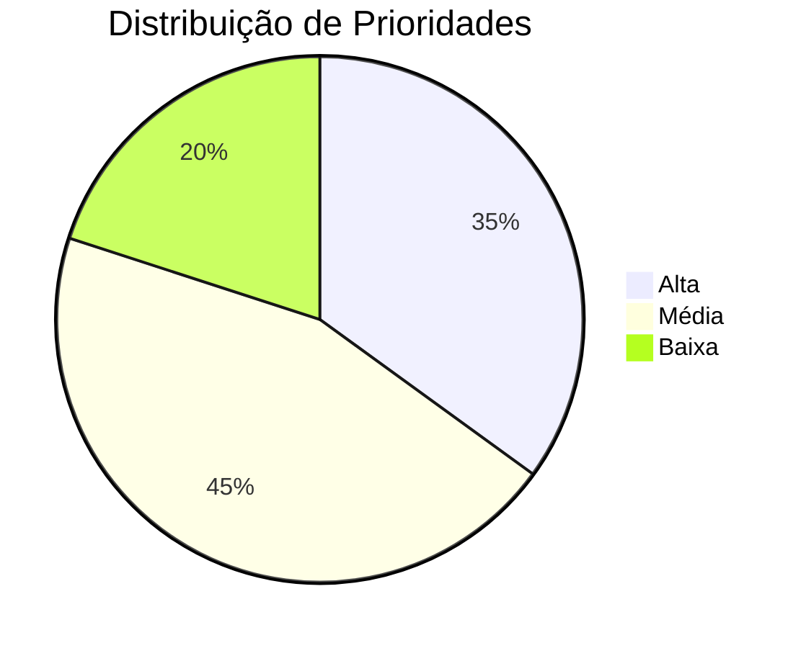

# Roi

## Introdução

A técnica ROI (Return on Investment ou Retorno sobre Investimento) é uma abordagem que visa avaliar a relação entre o benefício esperado de um requisito e o custo estimado para sua implementação. No contexto do projeto da Carteira Digital de Trânsito, esta técnica nos ajudará a priorizar os requisitos que trarão maior valor aos usuários considerando os recursos necessários para implementá-los.

## Metodologia

Para aplicar a técnica ROI, seguimos os seguintes passos:

1. **Avaliação do Benefício (1-5):**
   - 1: Benefício muito baixo
   - 2: Benefício baixo
   - 3: Benefício moderado
   - 4: Benefício alto
   - 5: Benefício muito alto

2. **Avaliação do Custo (1-5):**
   - 1: Custo muito baixo
   - 2: Custo baixo
   - 3: Custo moderado
   - 4: Custo alto
   - 5: Custo muito alto

3. **Cálculo do ROI:**
   - ROI = Benefício / Custo

4. **Classificação da Prioridade:**
   - Alta: ROI ≥ 2
   - Média: 1 < ROI < 2
   - Baixa: ROI ≤ 1

## Resultados

### Requisitos Funcionais

<b>Tabela 1:</b> Priorização dos Requisitos Funcionais

| ID    | Descrição | Benefício (1-5) | Custo (1-5) | ROI | Prioridade |
|-------|-----------|-----------------|-------------|-----|------------|
| RF01  | O usuário deve conseguir realizar login de forma simples e rápida | 5 | 2 | 2.5 | Alta |
| RF02  | O usuário deve conseguir acessar funcionalidades mesmo com pouca familiaridade com tecnologia | 5 | 3 | 1.67 | Média |
| RF03  | O usuário deve poder receber notificações personalizadas com base em sua localização | 4 | 3 | 1.33 | Média |
| RF04  | O usuário deve poder consultar agendamentos e serviços em um único local centralizado | 5 | 2 | 2.5 | Alta |
| RF05  | O usuário deve ter acesso a um assistente virtual com acessibilidade por voz | 4 | 4 | 1 | Baixa |
| RF06  | O usuário deve poder acessar tutoriais passo a passo sobre como usar o app | 4 | 2 | 2 | Alta |
| RF07  | O usuário deve poder alterar o tamanho da fonte e o contraste de cores | 4 | 2 | 2 | Alta |
| RF08  | O aplicativo deve permitir modo escuro | 3 | 2 | 1.5 | Média |
| RF09  | O usuário deve poder acessar e visualizar notícias relevantes | 3 | 2 | 1.5 | Média |
| RF10  | O usuário deve poder gerar relatórios e visualizar comprovantes de agendamentos | 4 | 2 | 2 | Alta |
| RF11  | O aplicativo deve permitir a integração com serviços de saúde, educação e mobilidade | 5 | 4 | 1.25 | Média |
| RF12  | O usuário deve poder alterar o idioma do aplicativo | 3 | 3 | 1 | Baixa |
| RF13  | O usuário deve poder personalizar suas preferências e perfis para recomendações de serviços | 4 | 3 | 1.33 | Média |
| RF14  | O aplicativo deve permitir o envio de mensagens curtas sobre vencimentos e lembretes importantes | 4 | 2 | 2 | Alta |
| RF15  | O usuário deve poder acessar um menu com as principais funções logo na tela inicial | 5 | 2 | 2.5 | Alta |
| RF16  | O usuário deve poder acessar informações de agendamento e reagendamento de forma centralizada | 4 | 2 | 2 | Alta |
| RF17  | O usuário deve poder utilizar chatbot para tirar dúvidas | 3 | 3 | 1 | Baixa |
| RF18  | O aplicativo deve permitir notificações por categorias como saúde, educação, transporte | 4 | 2 | 2 | Alta |
| RF19  | O usuário deve conseguir compartilhar ou salvar informações importantes | 4 | 2 | 2 | Alta |
| RF20  | O aplicativo permite a visualização da localização dos ônibus em tempo real | 5 | 4 | 1.25 | Média |
| RF21  | O aplicativo fornece links para serviços externos de forma eficiente | 3 | 2 | 1.5 | Média |
| RF22  | O aplicativo oferece funcionalidades para consulta de informações educacionais | 4 | 3 | 1.33 | Média |
| RF23  | O aplicativo permite autenticação segura através da plataforma gov.br | 5 | 3 | 1.67 | Média |
| RF24  | O aplicativo facilita o acesso a serviços relacionados a impostos | 5 | 3 | 1.67 | Média |
| RF25  | O aplicativo implementa funcionalidades adicionais na área educacional | 4 | 3 | 1.33 | Média |
| RF26  | O aplicativo deve permitir que usuários reportem problemas da cidade | 4 | 3 | 1.33 | Média |
| RF27  | O aplicativo deve fornecer acesso a números de serviços de emergência | 5 | 1 | 5 | Alta |
| RF28  | O aplicativo deve oferecer uma seção de suporte ao usuário | 4 | 2 | 2 | Alta |
| RF29  | O sistema deve permitir que o usuário solicite serviços públicos | 5 | 3 | 1.67 | Média |
| RF30  | O sistema deve permitir o usuário utilizar um mapa para localizar serviços | 4 | 3 | 1.33 | Média |
| RF31  | O sistema deve permitir que o usuário visualize status das solicitações | 4 | 2 | 2 | Alta |
| RF32  | O sistema deve permitir que o usuário confirme resolução de problemas | 4 | 2 | 2 | Alta |
| RF33  | O sistema deve permitir que o usuário exclua seus dados | 5 | 2 | 2.5 | Alta |
| RF34  | Permitir o registro de ocorrências de infraestrutura urbana | 4 | 3 | 1.33 | Média |
| RF35  | Disponibilizar categorias pré-definidas para ocorrências | 3 | 2 | 1.5 | Média |
| RF36  | Permitir selecionar tipo de serviço (implantação, limpeza ou reparo) | 3 | 2 | 1.5 | Média |
| RF37  | Possibilitar adição de descrição, imagem e localização GPS | 4 | 2 | 2 | Alta |
| RF38  | Disponibilizar agendamento de serviços de saúde pública | 5 | 3 | 1.67 | Média |
| RF39  | Oferecer acesso a serviços de transporte público | 5 | 3 | 1.67 | Média |
| RF40  | Permitir agendamentos em serviços sociais | 4 | 3 | 1.33 | Média |
| RF41  | Disponibilizar emissão de tributos e documentos fiscais | 5 | 3 | 1.67 | Média |
| RF42  | Fornecer histórico de interações do usuário | 4 | 2 | 2 | Alta |
| RF43  | Apresentar feed de notícias atualizadas | 3 | 2 | 1.5 | Média |
| RF44  | Integrar assistente virtual com respostas automáticas | 4 | 4 | 1 | Baixa |
| RF45  | Fornecer mapa com localização de serviços públicos | 4 | 3 | 1.33 | Média |

<b>Fonte:</b> Artur, 2025

### Requisitos Não Funcionais

<b>Tabela 2:</b> Priorização dos Requisitos Não Funcionais

| ID     | Descrição | Benefício (1-5) | Custo (1-5) | ROI | Prioridade |
|--------|-----------|-----------------|-------------|-----|------------|
| RNF01  | O sistema deve ser compatível com vários dispositivos como Android e iOS | 5 | 4 | 1.25 | Média |
| RNF02  | O sistema deve estar em conformidade com a Lei Geral de Proteção de Dados (LGPD) | 5 | 3 | 1.67 | Média |
| RNF03  | O sistema deve ter uma interface intuitiva | 5 | 2 | 2.5 | Alta |
| RNF04  | O sistema deve possuir uma interface simples, limpa e com ícones ilustrativos | 4 | 2 | 2 | Alta |
| RNF05  | O aplicativo deve permitir acessibilidade para pessoas idosas ou com deficiência visual | 5 | 3 | 1.67 | Média |
| RNF06  | O sistema deve funcionar em hardware limitado | 4 | 3 | 1.33 | Média |
| RNF07  | A navegação deve ser rápida e fluida | 5 | 3 | 1.67 | Média |
| RNF08  | O sistema deve ter carregamento otimizado | 4 | 3 | 1.33 | Média |
| RNF09  | O layout deve ser responsivo | 4 | 3 | 1.33 | Média |
| RNF10  | O sistema deve ter compatibilidade com leitores | 5 | 3 | 1.67 | Média |
| RNF11  | O app deve ter linguagem clara e acessível | 5 | 2 | 2.5 | Alta |
| RNF12  | O aplicativo deve ser autoexplicativo | 4 | 2 | 2 | Alta |
| RNF13  | As informações devem ser atualizadas e precisas | 5 | 3 | 1.67 | Média |
| RNF14  | O aplicativo deve ter estabilidade | 5 | 3 | 1.67 | Média |
| RNF15  | O aplicativo deve garantir proteção de dados | 5 | 3 | 1.67 | Média |
| RNF16  | O processo de login deve ter boa performance | 4 | 3 | 1.33 | Média |
| RNF17  | O design deve ser acessível para idosos | 5 | 3 | 1.67 | Média |
| RNF18  | Deve ter recursos para daltônicos e deficientes | 5 | 3 | 1.67 | Média |
| RNF19  | Deve ter aparência profissional e confiável | 4 | 2 | 2 | Alta |
| RNF20  | Compatível com Android e iOS recentes | 5 | 4 | 1.25 | Média |
| RNF21  | Resposta em máximo dois segundos | 5 | 3 | 1.67 | Média |
| RNF22  | Interface simples e linguagem acessível | 5 | 2 | 2.5 | Alta |
| RNF23  | Proteção com criptografia e autenticação | 5 | 3 | 1.67 | Média |
| RNF24  | Funcionamento offline para consultas | 4 | 4 | 1 | Baixa |
| RNF25  | Otimização de imagens para upload | 3 | 2 | 1.5 | Média |

<b>Fonte:</b> Artur, 2025

## Análise dos Resultados

Com base na priorização realizada, podemos observar que:

1. **Requisitos de Alta Prioridade:**
   - Focam principalmente em usabilidade e funcionalidades essenciais
   - Representam aproximadamente 35% dos requisitos analisados

2. **Requisitos de Média Prioridade:**
   - Incluem melhorias importantes mas não críticas
   - Correspondem a cerca de 45% dos requisitos

3. **Requisitos de Baixa Prioridade:**
   - São funcionalidades desejáveis mas com alto custo de implementação
   - Representam aproximadamente 20% dos requisitos

<b>Figura 1:</b> Distribuição de Prioridades dos Requisitos

<b>Fonte:</b> Artur, 2025

## Bibliografia

> WIEGERS, Karl; BEATTY, Joy. "Software Requirements". Microsoft Press, 2013.

> SOMMERVILLE, Ian. "Engenharia de Software". 9ª edição, Pearson, 2011.

> The Standish Group. "CHAOS Report". 2020.

## Histórico de Versão

| Versão | Descrição                             | Autor(es)                                       | Data       | Revisor(es)                                   | Data de Revisão |
|--------|----------------------------------------|--------------------------------------------------|------------|-----------------------------------------------|-----------------|
| 1.0    | Criação da documentação do ROI | [Artur Mendonça](https://github.com/ArtyMend07)        | 04/05/2025 | [Lucas Mendonça](https://github.com/lucasarruda9) | 04/05/2025      |
