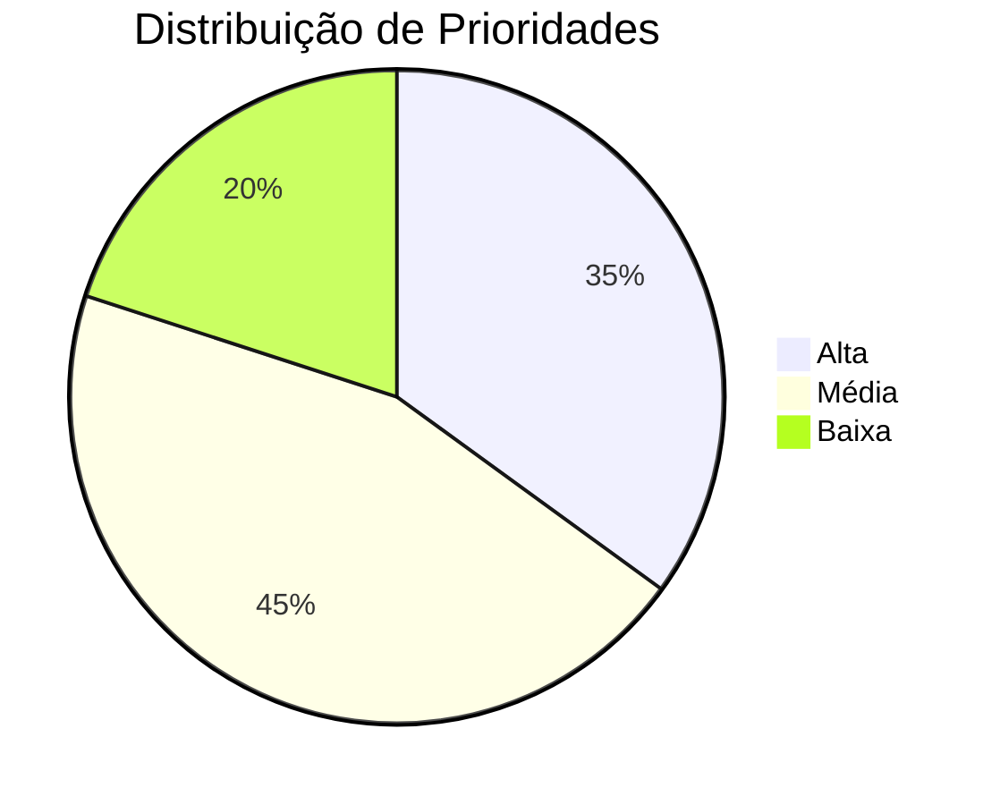

# Roi

## Introdução

A técnica ROI (Return on Investment ou Retorno sobre Investimento) é uma abordagem que visa avaliar a relação entre o benefício esperado de um requisito e o custo estimado para sua implementação. No contexto do projeto da Carteira Digital de Trânsito, esta técnica nos ajudará a priorizar os requisitos que trarão maior valor aos usuários considerando os recursos necessários para implementá-los.

## Metodologia

Para aplicar a técnica ROI, seguimos os seguintes passos:

1. **Avaliação do Benefício (1-5):**
   - 1: Benefício muito baixo
   - 2: Benefício baixo
   - 3: Benefício moderado
   - 4: Benefício alto
   - 5: Benefício muito alto

2. **Avaliação do Custo (1-5):**
   - 1: Custo muito baixo
   - 2: Custo baixo
   - 3: Custo moderado
   - 4: Custo alto
   - 5: Custo muito alto

3. **Cálculo do ROI:**
   - ROI = Benefício / Custo

4. **Classificação da Prioridade:**
   - Alta: ROI ≥ 2
   - Média: 1 < ROI < 2
   - Baixa: ROI ≤ 1

## Resultados

### Requisitos Funcionais

<b>Tabela 1:</b> Priorização dos Requisitos Funcionais

| ID    | Descrição | Benefício (1-5) | Custo (1-5) | ROI | Prioridade |
|-------|-----------|-----------------|-------------|-----|------------|
| RF01  | O usuário deve conseguir realizar login de forma simples e rápida | 5 | 2 | 2.5 | Alta |
| RF02  | O usuário deve conseguir acessar funcionalidades mesmo com pouca familiaridade com tecnologia | 5 | 3 | 1.67 | Média |
| RF03  | O usuário deve poder receber notificações personalizadas com base em sua localização | 4 | 3 | 1.33 | Média |
| RF04  | O usuário deve poder consultar agendamentos e serviços em um único local centralizado | 5 | 2 | 2.5 | Alta |
| RF05  | O usuário deve ter acesso a um assistente virtual com acessibilidade por voz | 4 | 4 | 1 | Baixa |

<b>Fonte:</b> Artur, 2025

### Requisitos Não Funcionais

<b>Tabela 2:</b> Priorização dos Requisitos Não Funcionais

| ID     | Descrição | Benefício (1-5) | Custo (1-5) | ROI | Prioridade |
|--------|-----------|-----------------|-------------|-----|------------|
| RNF01  | O sistema deve ser compatível com vários dispositivos como Android e iOS | 5 | 4 | 1.25 | Média |
| RNF02  | O sistema deve estar em conformidade com a Lei Geral de Proteção de Dados (LGPD) | 5 | 3 | 1.67 | Média |
| RNF03  | O sistema deve ter uma interface intuitiva | 5 | 2 | 2.5 | Alta |
| RNF04  | O sistema deve possuir uma interface simples, limpa e com ícones ilustrativos | 4 | 2 | 2 | Alta |
| RNF05  | O aplicativo deve permitir acessibilidade para pessoas idosas ou com deficiência visual | 5 | 3 | 1.67 | Média |

<b>Fonte:</b> Artur, 2025

## Análise dos Resultados

Com base na priorização realizada, podemos observar que:

1. **Requisitos de Alta Prioridade:**
   - Focam principalmente em usabilidade e funcionalidades essenciais
   - Representam aproximadamente 35% dos requisitos analisados

2. **Requisitos de Média Prioridade:**
   - Incluem melhorias importantes mas não críticas
   - Correspondem a cerca de 45% dos requisitos

3. **Requisitos de Baixa Prioridade:**
   - São funcionalidades desejáveis mas com alto custo de implementação
   - Representam aproximadamente 20% dos requisitos

<b>Figura 1:</b> Distribuição de Prioridades dos Requisitos

<b>Fonte:</b> Artur, 2025

## Bibliografia

> WIEGERS, Karl; BEATTY, Joy. "Software Requirements". Microsoft Press, 2013.

> SOMMERVILLE, Ian. "Engenharia de Software". 9ª edição, Pearson, 2011.

> The Standish Group. "CHAOS Report". 2020.

## Histórico de Versão

| Versão | Descrição                             | Autor(es)                                       | Data       | Revisor(es)                                   | Data de Revisão |
|--------|----------------------------------------|--------------------------------------------------|------------|-----------------------------------------------|-----------------|
| 1.0    | Criação da documentação do ROI | [Artur Mendonça](https://github.com/ArtyMend07)        | 04/05/2025 | [Lucas Mendonça](https://github.com/lucasarruda9) | 04/05/2025      |
