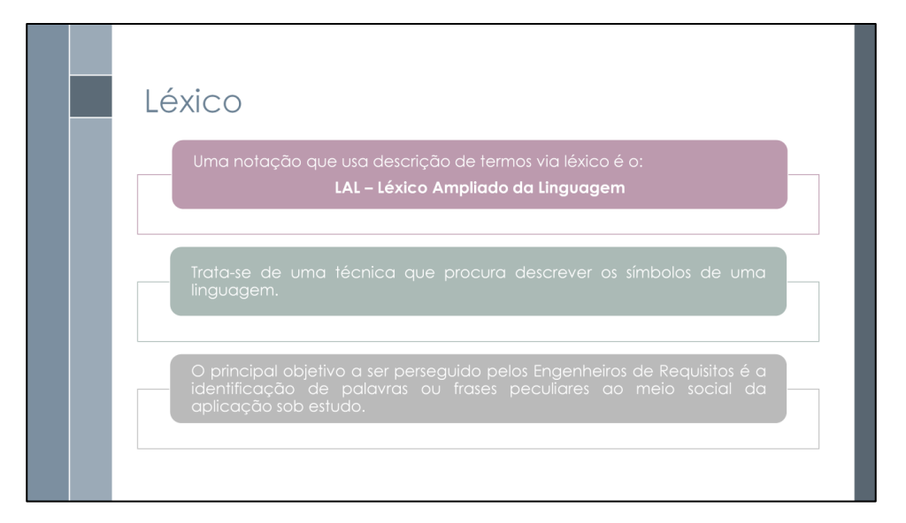
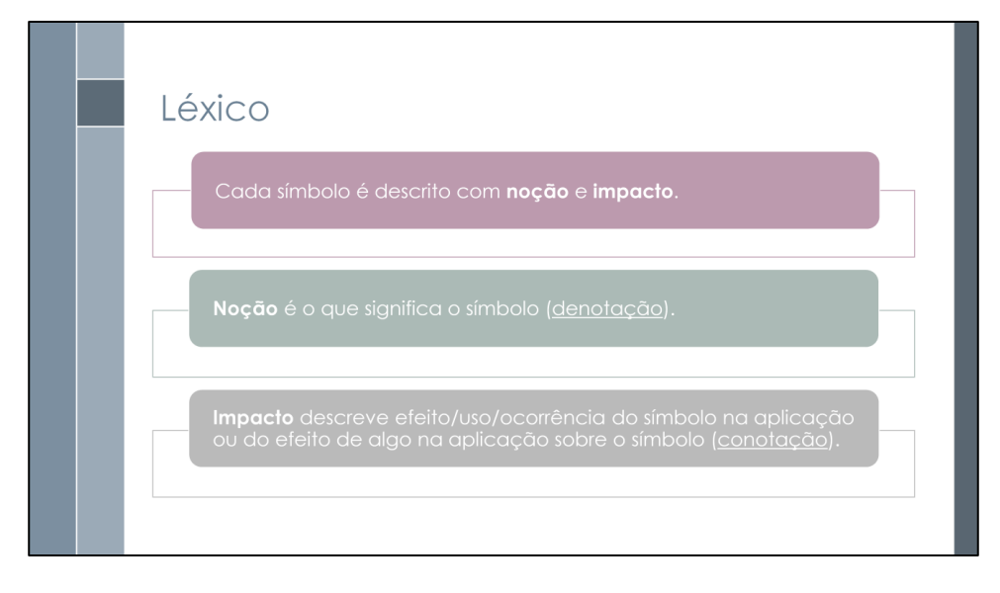
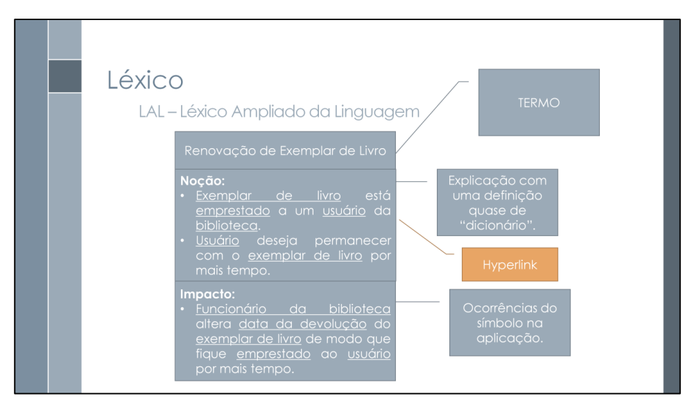
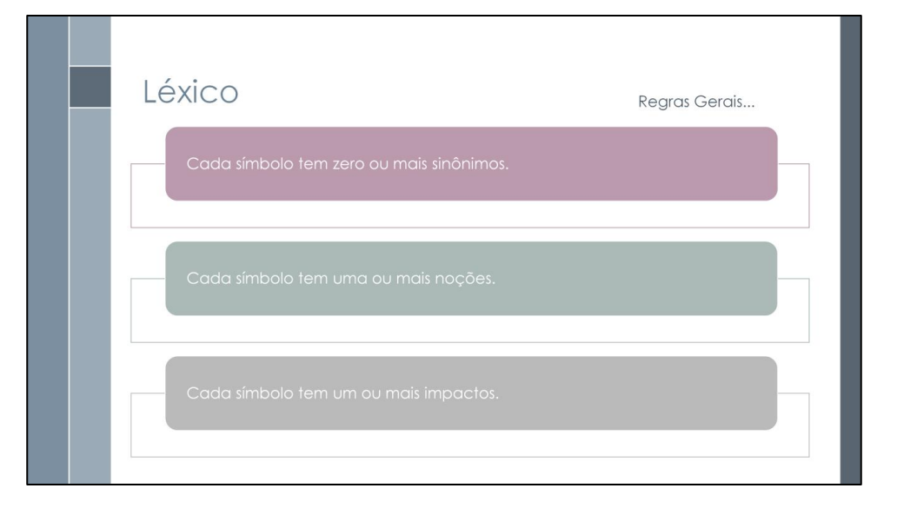
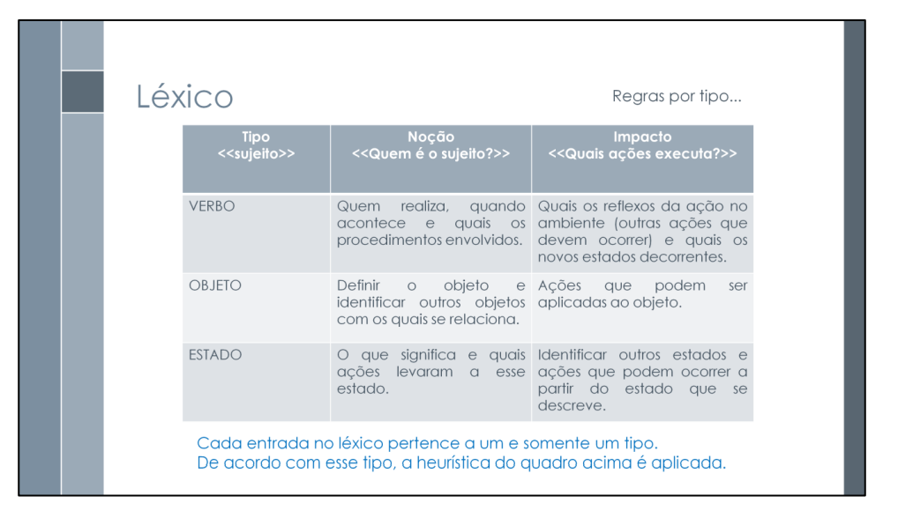

# Léxico

## Introdução

O léxico é uma técnica de modelagem que visa estabelecer um vocabulário comum entre os stakeholders do projeto, garantindo que todos compartilhem o mesmo entendimento sobre os termos utilizados no sistema. Esta técnica é particularmente útil para evitar ambiguidades e garantir a consistência na comunicação entre desenvolvedores, analistas e usuários.

## Metodologia

Para a elaboração deste léxico do sistema eGDF, adotamos a notação do Léxico Ampliado da Linguagem (LAL), que orienta a definição dos termos mais relevantes e suas relações com o sistema. A seguir, apresentamos duas tabelas que guiam a estruturação do documento:

- A Tabela 1 detalha os conceitos fundamentais para descrever cada termo do léxico.
- A Tabela 2 apresenta o template utilizado para organizar as informações de cada termo.

---

<b>Tabela 1</b> -  Léxico Ampliado da Linguagem (LAL)

| Tipo do símbolo | Noção | Impacto |
|-----------------|-------|-------|
| Verbo | Quem realiza, quando acontece e quais os procedimentos | Quais os reflexos das ações no ambiente e novos estados decorrentes |
| Objeto | Definir o objeto e identificar outros objetos com os quais ele se relaciona | Ações que podem ser aplicadas ao objeto  |
| Estado | O que indica e ações que levaram a esse estado | Identificar outros estados que podem ocorrer a partir do estado que se descreve  |

Fonte: [Artur Mendonça](https://github.com/ArtyMend07) e [Karoline Luz](https://github.com/karol). 

---

<b>Tabela 2</b> - Template Léxicos 

| **Campo**    | **Descrição**                                                                 |
|--------------|--------------------------------------------------------------------------------|
| **Símbolo**  | Nome do termo identificado na entrevista (entidade, ação ou estado relevante).|
| **Noção**    | Definição do termo: quem é, o que faz ou o que representa.                    |
| **Impacto**  | Efeitos da ação, uso do objeto ou implicações do estado descrito.             |
| **Sinônimos**| Termos equivalentes ou próximos encontrados durante a entrevista.             |
| **Tipo**     | Classificação como VERBO, OBJETO ou ESTADO, com base nas regras da Tabela 1.  |

Fonte: [Artur Mendonça](https://github.com/ArtyMend07) e [Karoline Luz](https://github.com/karol). 

---
## Léxico

### Tabela 3: Termos do Léxico - Brainstorming

| Símbolo | Noção | Impacto | Sinônimos | Tipo |
|---------|-------|---------|-----------|------|
| [Login](https://github.com/Requisitos-de-Software/2025.1-e-GDF/blob/main/docs/elicitacao/tec_elicitacao/brainstorming.md#anchor_BS), [AD01](https://github.com/Requisitos-de-Software/2025.1-e-GDF/blob/main/docs/elicitacao/tec_elicitacao/analise_documentos.md#anchor_AD) | Processo de autenticação do usuário no sistema através da plataforma gov.br, com opções como reconhecimento facial | Permite o acesso seguro às funcionalidades do aplicativo, garantindo a privacidade dos dados do usuário e uma experiência fluida | Autenticação, Acesso | Verbo |
| [Notificação](https://github.com/Requisitos-de-Software/2025.1-e-GDF/blob/main/docs/elicitacao/tec_elicitacao/brainstorming.md#anchor_BS) | Alerta ou mensagem enviada ao usuário sobre eventos relevantes, personalizada com base em sua localização | Mantém o usuário informado sobre atualizações, lembretes e eventos importantes relacionados aos serviços, melhorando a experiência do usuário | Alerta, Aviso | Objeto |
| [Assistente Virtual](https://github.com/Requisitos-de-Software/2025.1-e-GDF/blob/main/docs/elicitacao/tec_elicitacao/brainstorming.md#anchor_BS), [AD05](https://github.com/Requisitos-de-Software/2025.1-e-GDF/blob/main/docs/elicitacao/tec_elicitacao/analise_documentos.md#anchor_AD), [INT13](https://github.com/Requisitos-de-Software/2025.1-e-GDF/blob/main/docs/elicitacao/tec_elicitacao/introspeccao.md#anchor_INT) | Sistema automatizado que auxilia o usuário através de interações por voz ou texto, com respostas automáticas para dúvidas frequentes | Fornece suporte e orientação aos usuários, facilitando a navegação e resolução de dúvidas, especialmente para usuários com pouca familiaridade com tecnologia | Chatbot, Ajudante Virtual | Objeto |
| [Tutorial](https://github.com/Requisitos-de-Software/2025.1-e-GDF/blob/main/docs/elicitacao/tec_elicitacao/brainstorming.md#anchor_BS) | Guia passo a passo sobre como utilizar as funcionalidades do aplicativo, com instruções claras e acessíveis | Ajuda novos usuários a compreenderem as funcionalidades do sistema, reduzindo a necessidade de suporte externo | Guia, Manual | Objeto |
| [Acessibilidade](https://github.com/Requisitos-de-Software/2025.1-e-GDF/blob/main/docs/elicitacao/tec_elicitacao/brainstorming.md#anchor_BS), [EN08](https://github.com/Requisitos-de-Software/2025.1-e-GDF/blob/main/docs/elicitacao/tec_elicitacao/entrevista.md#anchor_EN), [AD08](https://github.com/Requisitos-de-Software/2025.1-e-GDF/blob/main/docs/elicitacao/tec_elicitacao/analise_documentos.md#anchor_AD) | Conjunto de recursos que tornam o aplicativo utilizável por pessoas com diferentes necessidades, incluindo ajuste de fonte, contraste e suporte a leitores de tela | Garante que o sistema possa ser utilizado por todos os usuários, independente de suas limitações, promovendo inclusão digital | Inclusão Digital | Estado |
| [Modo Escuro](https://github.com/Requisitos-de-Software/2025.1-e-GDF/blob/main/docs/elicitacao/tec_elicitacao/brainstorming.md#anchor_BS) | Tema visual com cores escuras para reduzir o brilho da tela e melhorar a experiência em ambientes com pouca luz | Melhora a experiência do usuário em ambientes com pouca luz, reduz o consumo de bateria e oferece opção de personalização | Tema Escuro | Estado |
| [Relatório](https://github.com/Requisitos-de-Software/2025.1-e-GDF/blob/main/docs/elicitacao/tec_elicitacao/brainstorming.md#anchor_BS) | Documento gerado pelo sistema contendo informações sobre atividades do usuário, como agendamentos e solicitações | Permite ao usuário acompanhar suas interações e serviços utilizados, facilitando o controle e organização | Comprovante, Registro | Objeto |
| [Idioma](https://github.com/Requisitos-de-Software/2025.1-e-GDF/blob/main/docs/elicitacao/tec_elicitacao/brainstorming.md#anchor_BS) | Configuração de linguagem do aplicativo, permitindo sua utilização em diferentes idiomas | Permite que usuários de diferentes nacionalidades utilizem o sistema em seu idioma preferido, promovendo inclusão | Linguagem | Estado |
| [Preferência](https://github.com/Requisitos-de-Software/2025.1-e-GDF/blob/main/docs/elicitacao/tec_elicitacao/brainstorming.md#anchor_BS) | Configurações personalizadas do usuário para adaptar o sistema às suas necessidades específicas | Adapta o sistema às necessidades específicas de cada usuário, melhorando a experiência de uso | Configuração, Personalização | Objeto |
| [Lembretes](https://github.com/Requisitos-de-Software/2025.1-e-GDF/blob/main/docs/elicitacao/tec_elicitacao/brainstorming.md#anchor_BS) | Alertas sobre eventos futuros ou pendências importantes para o usuário | Mantém o usuário informado sobre compromissos e prazos importantes, evitando esquecimentos | Alertas, Notificações | Objeto |
| [Agendamento](https://github.com/Requisitos-de-Software/2025.1-e-GDF/blob/main/docs/elicitacao/tec_elicitacao/brainstorming.md#anchor_BS) | Marcação de horário para serviços específicos, como atendimentos em órgãos públicos | Permite ao usuário organizar seus compromissos com serviços públicos de forma centralizada e eficiente | Marcação, Agenda | Verbo |
| [Compartilhamento](https://github.com/Requisitos-de-Software/2025.1-e-GDF/blob/main/docs/elicitacao/tec_elicitacao/brainstorming.md#anchor_BS) | Ação de distribuir informações do sistema com outros usuários, como protocolos ou comprovantes | Facilita a comunicação e troca de informações entre usuários, promovendo colaboração | Distribuição, Envio | Verbo |

Fonte: Elaborado pelos autores [Artur Mendonça](https://github.com/ArtyMend07) e [Karoline Luz](https://github.com/karol). 

## Bibliografia

> SERRANO, Milene; SERRANO, Maurício. Aula 10. Universidade de Brasília, Faculdade Gama, [s.d.]. Disponível em: https://aprender3.unb.br/pluginfile.php/3096108/mod_resource/content/1/Aula%2010.pdf. Acesso em: 15 mai. 2025.

> LUCIDCHART. O que é um léxico de aplicação? Disponível em: https://www.lucidchart.com/blog/pt-br/o-que-e-um-lexico-de-aplicacao. Acesso em: 15 mai. 2025.

> LEITE, J. C. S. P. et al. Enhancing a Requirements Baseline with Scenarios. In: INTERNATIONAL SYMPOSIUM ON REQUIREMENTS ENGINEERING, 1997, Annapolis. Proceedings... Los Alamitos: IEEE Computer Society Press, 1997. p. 44-53.

<figure>
    
    <figcaption>Fonte: SERRANO, Milene; SERRANO, Maurício. Aula 10. Universidade de Brasília, Faculdade Gama, [s.d.], p. 13.</figcaption>
</figure>

<figure>
    
    <figcaption>Fonte: SERRANO, Milene; SERRANO, Maurício. Aula 10. Universidade de Brasília, Faculdade Gama, [s.d.], p. 14.</figcaption>
</figure>

<figure>
    
    <figcaption>Fonte: SERRANO, Milene; SERRANO, Maurício. Aula 10. Universidade de Brasília, Faculdade Gama, [s.d.], p. 15.</figcaption>
</figure>

<figure>
    
    <figcaption>Fonte: SERRANO, Milene; SERRANO, Maurício. Aula 10. Universidade de Brasília, Faculdade Gama, [s.d.], p. 16.</figcaption>
</figure>

<figure>
    
    <figcaption>Fonte: SERRANO, Milene; SERRANO, Maurício. Aula 10. Universidade de Brasília, Faculdade Gama, [s.d.], p. 17.</figcaption>
</figure>

## Histórico de Versões

| Versão | Descrição | Autor(es) | Data | Revisor(es) | Data de Revisão |
|--------|-----------|-----------|------|-------------|-----------------|
| 1.0 | Criação do documento de léxico | [Artur Mendonça](https://github.com/ArtyMend07) e [Karoline Luz](https://github.com/karol) | 15/05/2025 | [Lucas Mendonça](https://github.com/lucasarruda9) e [Gabriel Lopes](https://github.com/GabrielLopes0) | 20/05/2025|
| 1.1 | Adição das imagens de referência |  [Artur Mendonça](https://github.com/ArtyMend07) e [Karoline Luz](https://github.com/karol) | 15/05/2025 | [Lucas Mendonça](https://github.com/lucasarruda9) e [Gabriel Lopes](https://github.com/GabrielLopes0) | 20/05/2025|
| 1.2 | Ajustes nas tabelas do léxico conforme novo modelo base |  [Artur Mendonça](https://github.com/ArtyMend07) e [Karoline Luz](https://github.com/karol)| 15/05/2025 |  [Lucas Mendonça](https://github.com/lucasarruda9) e [Gabriel Lopes](https://github.com/GabrielLopes0)| 20/05/2025 |